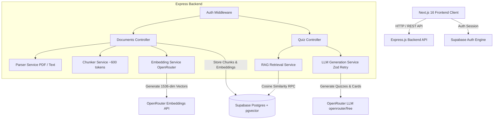
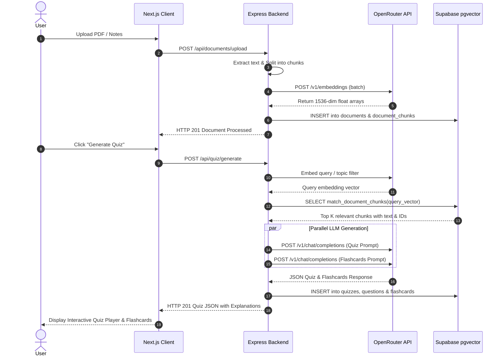

# System Architecture & RAG Pipeline

## System Architecture Diagram

---

## Retrieval-Augmented Generation (RAG) Flow

---

## Service Layer Responsibilities

1. **Parser Service (`server/src/services/parser.service.js`)**:
   - Parses binary PDF buffers via `pdf-parse` or processes plain text inputs.
   - Cleans whitespace and normalizes text encoding.

2. **Chunker Service (`server/src/services/chunker.service.js`)**:
   - Splits document text into overlapping semantic chunks (~600 tokens target, ~100 token overlap).
   - Assigns sequential `chunk_index` numbers.

3. **Embedding Service (`server/src/services/embedding.service.js`)**:
   - Sends text chunks to OpenRouter embeddings endpoint (`openai/text-embedding-3-small`).
   - Uses IPv4 DNS socket binding (`family: 4`) to prevent network timeouts.

4. **Retrieval Service (`server/src/services/retrieval.service.js`)**:
   - Invokes Supabase Postgres RPC function `match_document_chunks`.
   - Computes cosine distance similarity (`1 - (dc.embedding <=> query_embedding)`).
   - Includes automatic full-text fallback if vector embeddings are absent.

5. **Generation Service (`server/src/services/generation.service.js`)**:
   - Constructs strict prompt templates referencing source chunk UUIDs.
   - Mandates detailed educational explanations for all generated questions.
   - Enforces Zod JSON output schema validation (`QuizOutputSchema` & `FlashcardsOutputSchema`) with automatic 1-step retry logic on malformed JSON.
