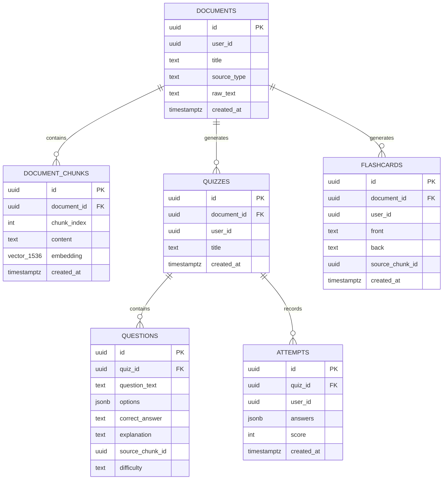

# Database & Vector Search Schema

The LearnForge database is hosted on PostgreSQL (Supabase) and utilizes the **`pgvector`** extension for storing and performing high-speed cosine similarity vector searches across 1536-dimensional OpenRouter embeddings.

## Entity Relationship Diagram (ERD)



---

## Vector Extension & Indexing

```sql
-- Enable vector extension
CREATE EXTENSION IF NOT EXISTS vector;

-- Cosine Distance IVFFLAT Index for fast 1536-dim vector searches
CREATE INDEX IF NOT EXISTS idx_document_chunks_embedding_ivfflat 
ON public.document_chunks USING ivfflat (embedding vector_cosine_ops) WITH (lists = 100);
```

---

## Vector Similarity Search RPC (`match_document_chunks`)

The backend calls this stored procedure via `supabaseAdmin.rpc('match_document_chunks', ...)` during RAG retrieval:

```sql
CREATE OR REPLACE FUNCTION match_document_chunks(
    query_embedding vector(1536),
    match_count INT DEFAULT 5,
    filter_doc_id UUID DEFAULT NULL
)
RETURNS TABLE (
    id UUID,
    document_id UUID,
    chunk_index INT,
    content TEXT,
    similarity FLOAT
)
LANGUAGE plpgsql
AS $$
BEGIN
    RETURN QUERY
    SELECT
        dc.id,
        dc.document_id,
        dc.chunk_index,
        dc.content,
        1 - (dc.embedding <=> query_embedding) AS similarity
    FROM public.document_chunks dc
    WHERE (filter_doc_id IS NULL OR dc.document_id = filter_doc_id)
      AND dc.embedding IS NOT NULL
    ORDER BY dc.embedding <=> query_embedding
    LIMIT match_count;
END;
$$;
```

---

## Row Level Security (RLS) Policies

All tables enforce PostgreSQL Row Level Security to isolate data per user:

```sql
ALTER TABLE public.documents ENABLE ROW LEVEL SECURITY;
ALTER TABLE public.document_chunks ENABLE ROW LEVEL SECURITY;
ALTER TABLE public.quizzes ENABLE ROW LEVEL SECURITY;
ALTER TABLE public.questions ENABLE ROW LEVEL SECURITY;
ALTER TABLE public.flashcards ENABLE ROW LEVEL SECURITY;
ALTER TABLE public.attempts ENABLE ROW LEVEL SECURITY;

CREATE POLICY "Users can manage their own documents"
ON public.documents FOR ALL USING (auth.uid() = user_id);

CREATE POLICY "Users can access chunks of their own documents"
ON public.document_chunks FOR ALL USING (
    EXISTS (SELECT 1 FROM public.documents d WHERE d.id = document_chunks.document_id AND d.user_id = auth.uid())
);
```
